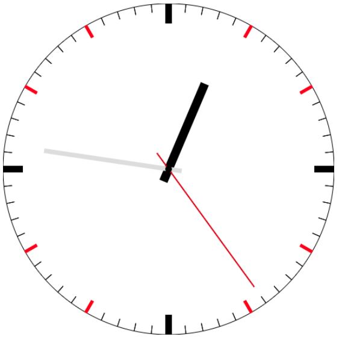

# Easter_clock

## 封装的时钟组件

# 目前是一个能够根据给定的直径自适应的时钟，比例：时针长 r*（160/250），分针长 r*（210/250），秒针长r*（250/250）
指针粗细，长短，刻度粗细，都相对半径变化。

## clock（）函数传入的参数是整个canvas画布的边长，默认是正方形不可改变

## 调用：clock(500）。只需要在html中插入canvas标签调用函数传入参数就可以

